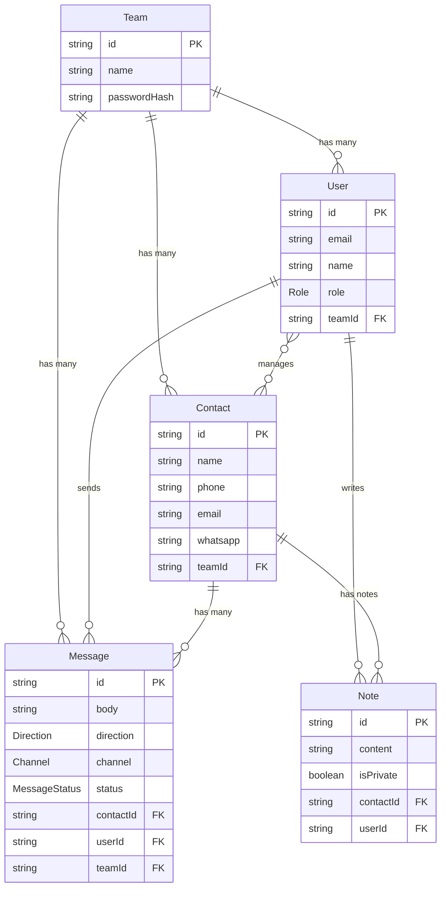

# Unified Inbox – Multi-Channel Customer Outreach Platform
> A unified communication platform that centralizes **SMS and WhatsApp** messaging, enables **real-time collaboration**, and supports **multi-team management** — powered by **Next.js 14 + TypeScript + Prisma + Twilio + Socket.IO**.

---
## Features Implemented

| Category | Feature | Status |
|-----------|----------|--------|
| **Authentication** | Secure login via Better Auth| ✅ |
| **Channels** | Twilio **SMS** and **WhatsApp** integration (send & receive) | ✅ |
| **Unified Inbox** | Real-time threaded view grouped by contact | ✅ |
| **Teams** | Multi-team separation with access control | ✅ |
| **Notes Collaboration** | Real-time notes with Socket.IO sync | ✅ |
| **Database** | PostgreSQL via Prisma ORM | ✅ |
| **Socket Server** | Dedicated Node.js Socket.IO server for sync | ✅ |
| **Extensibility** | Modular integration architecture | ✅ |

---
## Tech Stack
- **Frontend / Backend:** Next.js (App Router) + TypeScript
- **Database:** PostgreSQL + Prisma ORM
- **Real-Time:** Socket.IO (separate Node.js service)
- **Integrations:** Twilio (SMS + WhatsApp Sandbox)
- **Authentication:** Better Auth (credentials / Google)
- **Styling:** Tailwind CSS

---
## Setup Instructions
1.  **Clone the repository**
    ```bash
    git clone https://github.com/VinayN3gi/unified-inbox.git
    cd unified-inbox
    ```

2.  **Install dependencies**
    ```bash
    npm install
    ```
    *(Note: This assumes `concurrently` and `tsx` are listed as dev dependencies in your `package.json`)*

3.  **Setup environment**
    Copy `.env.example` to `.env` and fill in the following values:
    ```.env
    DATABASE_URL=
    JWT_SECRET=
    BETTER_AUTH_SECRET=
    NEXT_PUBLIC_APP_URL=http://localhost:3000

    TWILIO_ACCOUNT_SID=
    TWILIO_AUTH_TOKEN=
    TWILIO_PHONE_NUMBER=
    TWILIO_WHATSAPP_NUMBER=

    SOCKET_SERVER_URL=http://localhost:3001
    ```

4.  **Run database migrations**
    ```bash
    npx prisma migrate dev
    ```

5.  **Update `package.json` scripts**
    Ensure your `package.json` `scripts` section is updated to run both servers concurrently.
    ```json
    "scripts": {
      "dev": "concurrently \"npm run dev:next\" \"npm run dev:socket\"",
      "dev:next": "next dev",
      "dev:socket": "tsx watch socket-server.ts",
      "build": "next build",
      "start": "concurrently \"npm run start:next\" \"npm run start:socket\"",
      "start:next": "next start",
      "start:socket": "tsx socket-server.ts",
      "lint": "eslint"
    },
    ```

6.  **Start the development servers**
    This single command will start both the Next.js app and the Socket.IO server.
    ```bash
    npm run dev
    ```
    - The Next.js app will be available at `http://localhost:3000`.
    - The Socket.IO server will be running on `http://localhost:3001`.

## ERD – Entity Relationship Diagram



## Integration Comparison Table
| Channel | Latency | Cost (USD/msg) | Reliability | Notes |
|---|---|---|---|---|
| SMS (Twilio) | ~300 ms | $0.0075 | 99.9 % | Fast, direct delivery |
| WhatsApp (Twilio) | ~400 ms | $0.014 | 99.8 % | Sandbox enabled |
| Socket Server | <100 ms | Free | 99.9 % | Internal sync |

## Folder Structure
*(Based on the provided screenshot)*
```
UNIFIED-INBOX/
│
├── app/
│   ├── api/
│   │   ├── auth/
│   │   ├── contacts/
│   │   ├── messages/
│   │   ├── notes/
│   │   ├── webhooks/
│   │   ├── whatsapp/
│   │   └── workspace/
│   ├── dashboard/
│   ├── login/
│   ├── signup/
│   ├── layout.tsx
│   └── page.tsx
│
├── components/         # Reusable UI components
├── lib/                # Helper functions, Prisma client, etc.
├── prisma/             # Prisma schema and migrations
├── public/             # Static assets
│
├── .env                # Environment variables
├── next.config.ts      # Next.js configuration
├── package.json        # Project dependencies and scripts
└── socket-server.ts    # Socket.IO server (based on scripts)
```

## Key Design Decisions
- **Unified Schema:** Normalized all channels into a single `Message` model.
- **Event-Driven Updates:** Real-time collaboration powered by WebSockets.
- **Workspace Isolation:** Each workspace has its own contacts and threads.
- **Integration Factory:** Scalable channel abstraction (`createSender('sms')`, etc.).
- **Scalability Ready:** Socket server separated for horizontal scaling.

##  Demo Video
▶️ **Online Demo**

[🎥 Click here to watch the full demo](https://www.loom.com/share/INSERT_VIDEO_LINK_HERE)

## 👨‍💻 Author
**Vinay Negi**
Tech Stack: Next.js • TypeScript • Prisma • Twilio • Socket.IO
